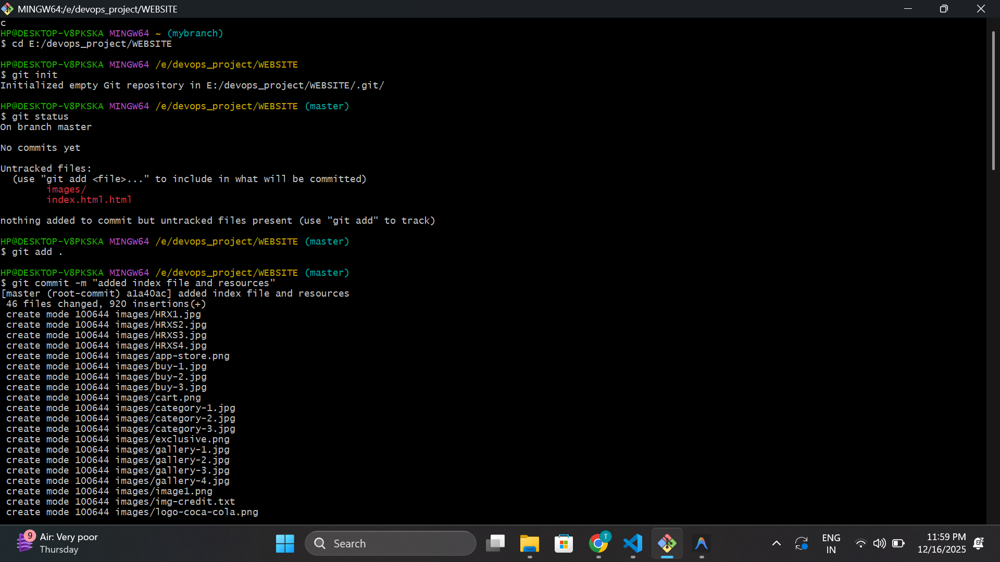
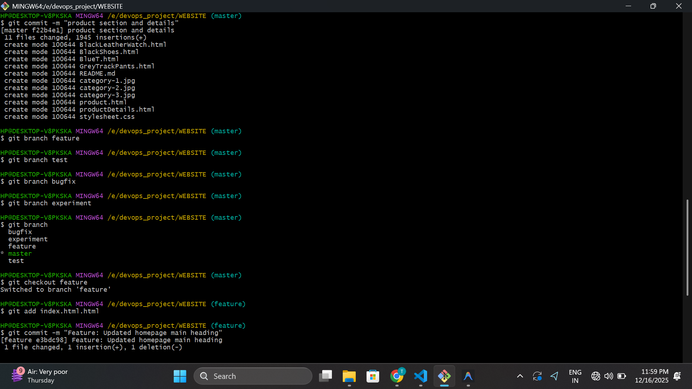
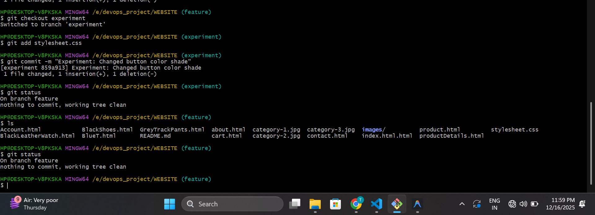
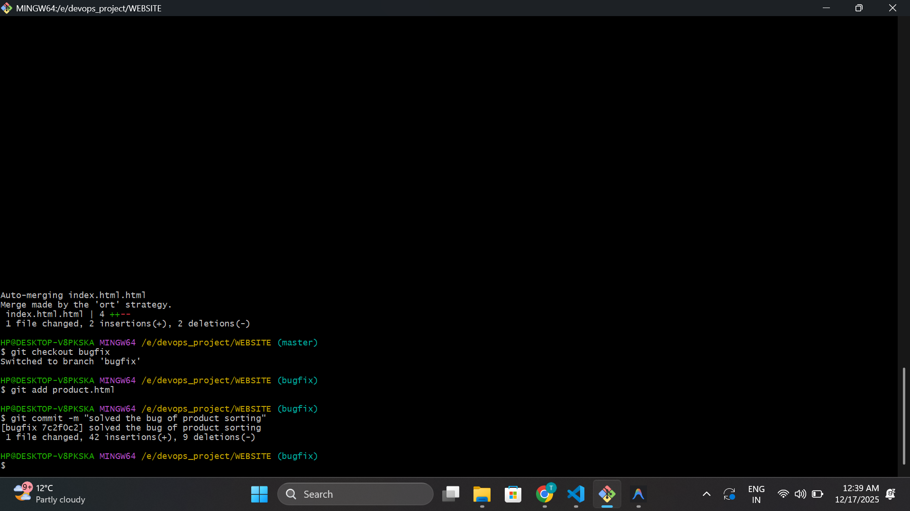
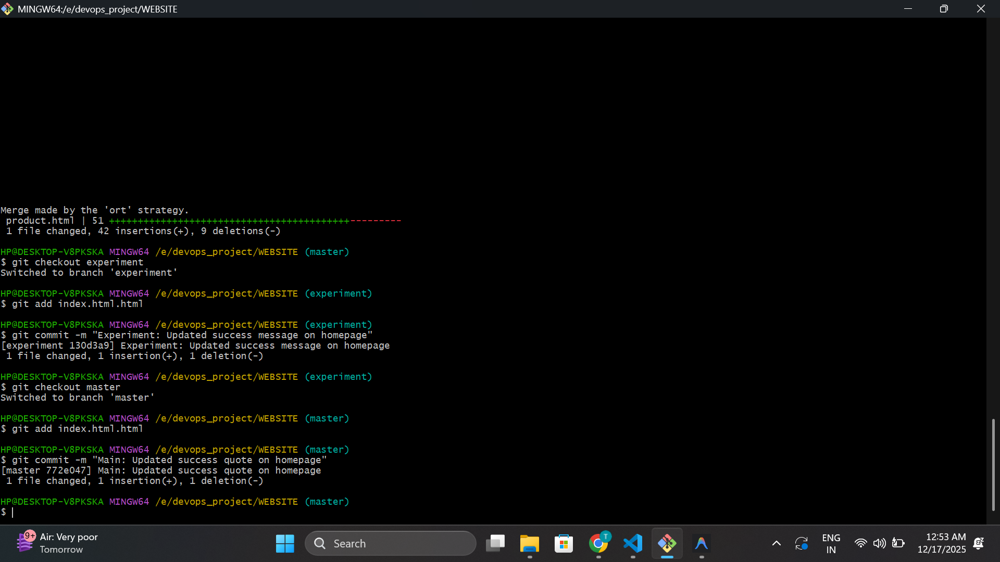
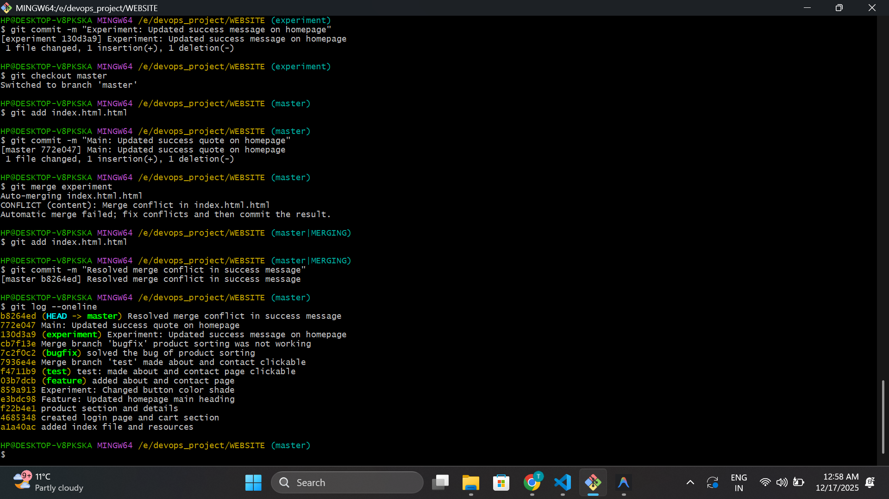
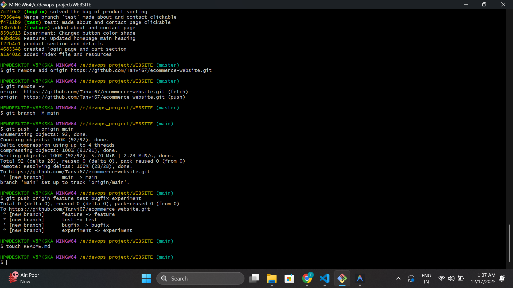

# Git Bash & GitHub Hands-On Project  
## Fashion Retail Website

---

## Introduction

This project is a **Fashion Retail Website** developed using **HTML and CSS** as part of the **Git Bash & GitHub Hands-On Project**.  
The primary objective of this project is to gain practical experience with **Git version control** and **GitHub remote repository management**.

In this project, Git Bash was used to:
- Initialize a local Git repository
- Track project files using staging and commits
- Create and manage multiple branches
- Perform merge operations
- Demonstrate and resolve a merge conflict
- Push the project to a remote GitHub repository

This project helped in understanding how version control systems manage code changes efficiently and support collaborative development.

---

## Commands Used

The following Git commands were used throughout the project to manage version control operations:

```bash
git init
git status
git add .
git commit -m "commit message"
git branch
git checkout
git merge
git log --oneline
git remote add origin
git push
git pull
git clone
```

---

## Screenshots

The following screenshots demonstrate the Git operations performed during the project:

### Repository Initialization and First Commit


### Second and Third Commits


### Feature Branch Creation and Commit


### Experiment Branch Commit


### Merge Feature and Test Branch into Main


### Merge Conflict Creation


### Conflict Resolution and Commit History


### Push to GitHub Repository



---

## Challenges and Conclusion

### Challenges Faced
- Understanding the flow of Git operations such as working directory, staging area, and commits
- Managing multiple branches and ensuring correct merges
- Handling merge conflicts when the same file was modified in different branches
- Maintaining clear and meaningful commit messages
- Organizing screenshots and documentation using Markdown

### Conclusion
This project provided hands-on experience with **Git Bash and GitHub**.  
It helped in understanding essential version control concepts such as repository initialization, branching, merging, conflict resolution, and remote repository management.  
Overall, this project improved practical knowledge of Git and increased confidence in using version control systems for real-world development projects.

---
